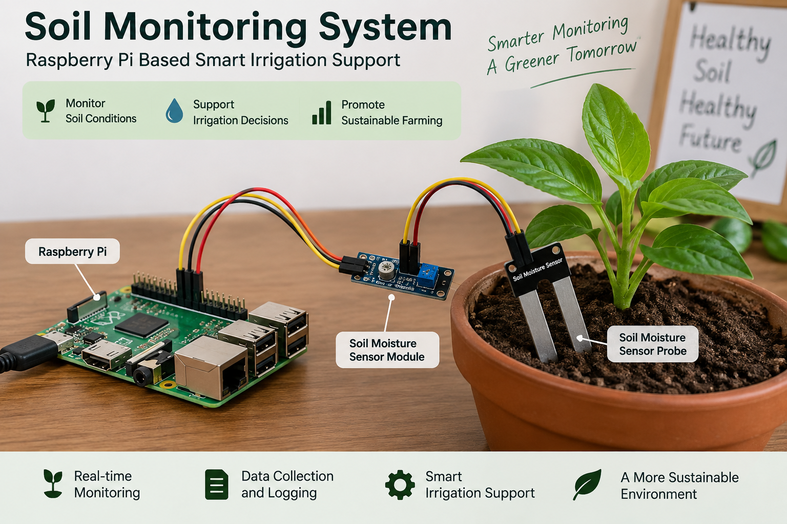
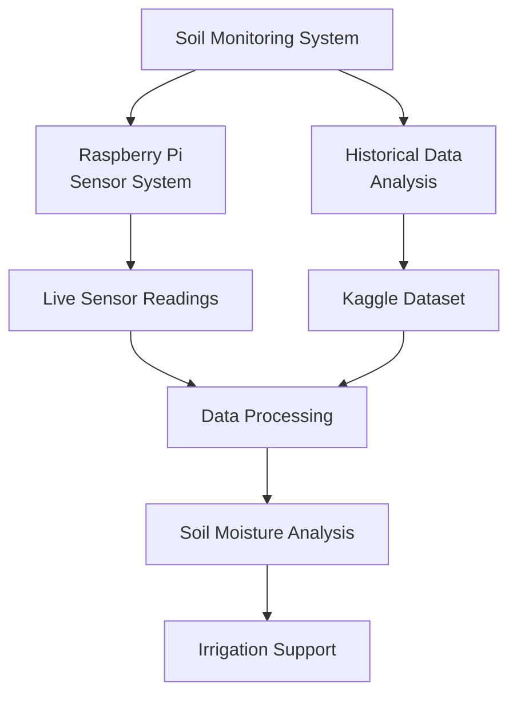
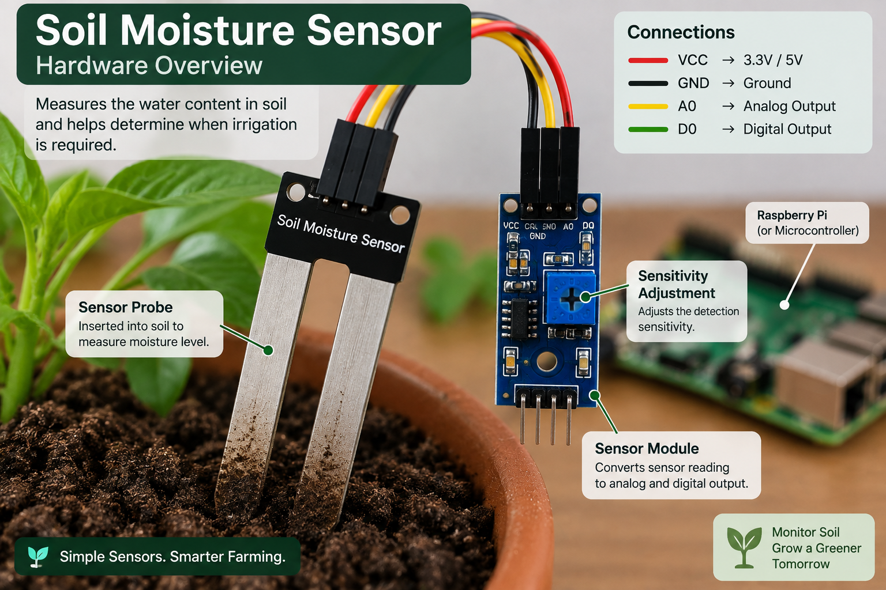
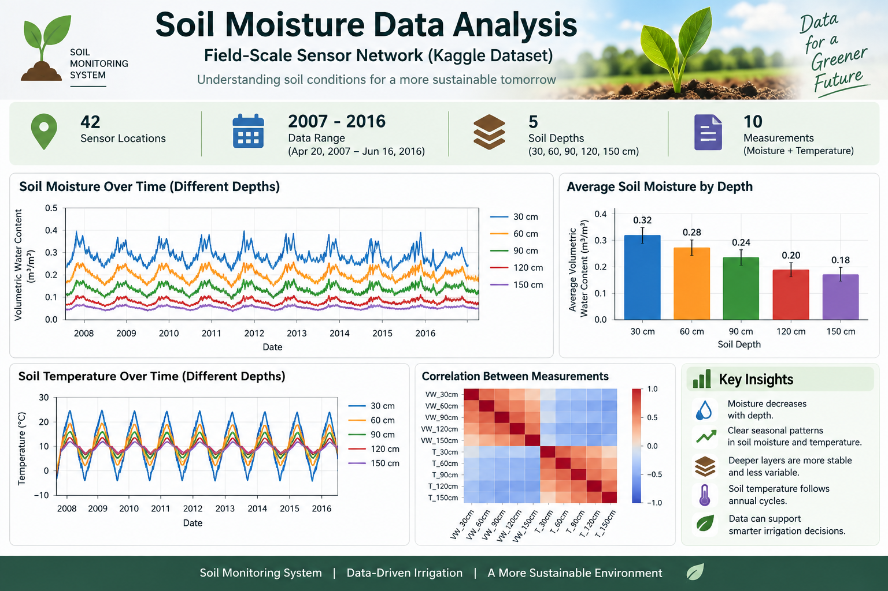

<h1 align="center">🌱 Soil Monitoring System</h1>

<p align="center">
  A Raspberry Pi and Python project that monitors soil conditions and supports data-driven irrigation decisions.
</p>

<p align="center">
  
  
  
  
  
</p>

<p align="center">
  
</p>

---

## 📖 Overview

Irrigating on a fixed schedule often wastes water. This project irrigates based on **actual soil conditions** instead. It has two parts:

1. **Raspberry Pi sensor system:** reads soil sensors in real time, classifies the soil condition and recommends whether to irrigate.
2. **Historical data analysis:** explores a public field-scale dataset of soil-moisture readings to understand how moisture varies at different depths over time.

## 🎯 Objectives

- Monitor soil conditions using Raspberry Pi sensors
- Collect and record soil-monitoring readings
- Analyse historical soil-moisture measurements
- Study moisture variation at different soil depths
- Support irrigation decisions based on observed soil conditions
- Reduce unnecessary water usage through condition-based monitoring

## 🏗️ Project Architecture



## 📡 Raspberry Pi Monitoring

The monitoring program reads sensor values through the GPIO pins and keeps checking soil conditions. It provides:

- 📊 Live sensor readings
- 🏷️ Soil condition classification
- 💧 Irrigation recommendation
- 🕒 Timestamped monitoring
- 📝 CSV-based local logging
- 🔒 Safe GPIO cleanup on exit

<p align="center">
  
</p>

Run it on the Raspberry Pi with:

```bash
python3 src/soil_monitor.py
```

## 📈 Dataset Analysis

The analysis part uses the Kaggle dataset **[Soil Moisture data from field scale sensor network](https://www.kaggle.com/datasets/sathyanarayanrao89/soil-moisture-data-from-field-scale-sensor-network)**. It contains daily and hourly sensor measurements from multiple locations, covering **April 20, 2007 to June 16, 2016**.

| Measurement | Columns (by depth) |
|---|---|
| 💧 Volumetric water content | `VW_30cm`, `VW_60cm`, `VW_90cm`, `VW_120cm`, `VW_150cm` |
| 🌡️ Soil temperature | `T_30cm`, `T_60cm`, `T_90cm`, `T_120cm`, `T_150cm` |

<p align="center">
  
</p>

### Running the analysis

Download the dataset from Kaggle and place it locally like this:

```text
data/
└── archive/
    ├── Daily/
    │   ├── CAF003.txt
    │   ├── CAF007.txt
    │   └── ...
    └── Hourly/
        └── ...
```

Then run:

```bash
python3 src/data_analysis.py
```

The program loads the sensor files, combines the available readings, cleans the data, calculates summary statistics and generates an analysis-ready CSV file.

## ⚙️ Installation

**1. Clone the repository**

```bash
git clone https://github.com/saniashaik5892-prog/soil-monitoring-system.git
cd soil-monitoring-system
```

**2. Install the dependencies**

```bash
pip install -r requirements.txt
```

> 💡 The monitoring script needs a Raspberry Pi with the sensor connected. The data analysis script runs on any computer.

## 📁 Project Structure

```text
soil-monitoring-system/
├── src/
│   ├── soil_monitor.py      # Raspberry Pi sensor monitoring
│   └── data_analysis.py     # Historical dataset analysis
├── data/
│   ├── archive/             # Kaggle dataset (Daily and Hourly), not included
│   └── README.md            # Notes about the data
├── images/                  # Setup photos and analysis charts
├── requirements.txt
├── .gitignore
└── README.md
```

## 🧰 Technologies Used

| Area | Tools |
|---|---|
| Language | Python |
| Hardware | Raspberry Pi, GPIO, soil moisture sensors |
| Data analysis | Pandas, NumPy |
| Visualisation | Matplotlib, Seaborn |
| Version control | Git, GitHub |

## 🔐 Data Privacy and Repository Size

- The Kaggle dataset is **third-party data and is large**, so it is not stored in this repository. Please download it from the link above and follow the dataset's own terms.
- Local sensor logs and generated CSV files are kept out of version control through `.gitignore` to keep the repository small and clean.

## 🚀 Future Improvements

- [ ] Automatically switch a pump or relay on and off
- [ ] Show live readings on a dashboard
- [ ] Send alerts when soil becomes too dry
- [ ] Combine temperature and humidity data for smarter irrigation

## 👩‍💻 Author

**Shaik Sania**, B.Tech CSE (IoT) student at VVIT
🔗 GitHub: [@saniashaik5892-prog](https://github.com/saniashaik5892-prog)

---

<p align="center"><i>If you find this useful, please give it a ⭐</i></p>
